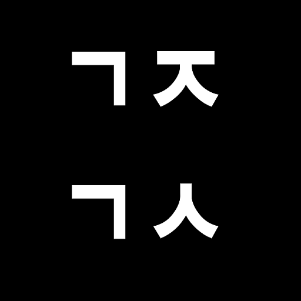

# project 영역 만들기

https://pangol.github.io/page101/ 에서 project 영역을 만들어보겠습니다.
col을 이용해서 영역을 나누고 브라우저 크기가 클 때는 이미지를 우측으로 배치하고
작을 때는 이미지가 사라지게 하는 기능이 들어가 있습니다.

## 틀 잡기 - container, row

우선 프로젝트 영역을 감싸줄 태그를 작성합니다.

```
<div class="container project" id="project">
  <div class="row">
  </div>
</div>
```

## 영역 나누기 - col
row 안에 col을 이용해서 영역을 나누겠습니다. 총 4개의 컨텐츠를 한 줄에 두 개씩 배치하려고 합니다.
한 컨텐츠에 col-md-6 와 col-sm-12를 줘서 브라우저 크기에 반을 차지하게 합니다.

```
<div class="container project" id="project">
  <div class="row">
    <div class="col-md-6 col-sm-12 mb-2">
    </div>
    <div class="col-md-6 col-sm-12 mb-2">
    </div>
    <div class="col-md-6 col-sm-12 mb-2">
    </div>
    <div class="col-md-6 col-sm-12 mb-2">
    </div>
  </div>
</div>
```

## 컨텐츠 작성하기

이제 하나의 컬럼안에 콘텐츠를 작성할 차례입니다. 콘텐츠는 card를 이용해서 작성할 겁니다.
프로젝트 컨텐츠가 표시된 방법을 보면 브라우저 크기가 클 때는 텍스트가 왼편에 이미지가 오른편에 배치되고 줄어들면 사라지게 됩니다. 이 기능을 적용하기 위해서는 flex-md-row 를 사용합니다. flex-md-row는 행으로 요소들을 배치하게 합니다.

```
<div class="col-md-6 col-sm-12 mb-2">
  <div class="card flex-md-row border-white">
    <div class="card-body">
      <h5 class="card-title">검정고시 문제풀이</h5>
      <p class="card-text">검정고시 기출문제를 풀어볼 수 있는 어플리케이션입니다. </p>
      <a href="https://github.com/pangol/highschoolSolution" target="_blank" class="btn btn-primary"><i class="fab fa-github"></i></a>
      <a href="https://play.google.com/store/apps/details?id=appinventor.ai_pangol75.science_past" class="btn btn-primary" target="_blank"><i class="fab fa-google-play"></i></a>
    </div>
    
  </div>
</div>
```
flex-md-row안에 작성된 요소들은 행으로 순서대로 배치되게 됩니다. 따라서 card-body가 우선 왼편에 배치되고 img 요소가 우측으로 배치됩니다.

img 태그에서 사용된 클래스는 d-none, d-lg-block입니다. d-none은 display을 none으로 설정해서 나타나지 않게 하는 설정이며 d-lg-block는 브라우저 크기가 lg이상이면 display를 block로 변경하여 보이게 합니다.

## 반복해서 세 번 더 작성하기

```
<div class="container project" id="project">
  <div class="row">
    <div class="col-md-6 col-sm-12 mb-2">
      <div class="card flex-md-row border-white">
        <div class="card-body">
          <h5 class="card-title">검정고시 문제풀이</h5>
          <p class="card-text">검정고시 기출문제를 풀어볼 수 있는 어플리케이션입니다.</p>
          <a href="https://github.com/pangol/highschoolSolution" target="_blank" class="btn btn-primary"><i class="fab fa-github"></i></a>
          <a href="https://play.google.com/store/apps/details?id=appinventor.ai_pangol75.science_past" class="btn btn-primary" target="_blank"><i class="fab fa-google-play"></i></a>
        </div>
        
      </div>
    </div>
    <div class="col-md-6 col-sm-12 mb-4">
      <div class="card flex-md-row border-white">
        <div class="card-body">
          <h5 class="card-title">중고핸드폰을 이용한 서버 구축</h5>
          <p class="card-text">중고 핸드폰을 활용해서 클라우드 서비스를 구축하는 프로젝트입니다.<br>
          현재 진행중에 있습니다.</p>
        </div>
        
      </div>
    </div>
    <div class="col-md-6 col-sm-12 mb-4">
      <div class="card flex-md-row border-white">
        <div class="card-body">
          <h5 class="card-title">넷 중립성을 위한 네트워크 만들기</h5>
          <p class="card-text">넷 중립성을 위해서 대기업에서 운영하는 통신망이 아니라 직접 네트워크를 만드는 프로젝트입니다.메쉬 네트워크를 기반으로 개발 중에 있으며 블록체인을 활용합니다.
          <br>현재 연구중에 있습니다</p>
        </div>
        
      </div>
    </div>
    <div class="col-md-6 col-sm-12 mb-2">
      <div class="card flex-md-row border-white">
        <div class="card-body">
          <h5 class="card-title">수화 통역 인공지능</h5>
          <p class="card-text">수화를 통역해서 한글로 출력해주는 인공지능 엔진을 개발합니다.python + opencv를 활용하며 스마트 글래스에 연동시키는 프로젝트입니다. 현재 연구중에 있습니다.</p>
        </div>
        
      </div>
    </div>
  </div>
</div>
```

flex 관련해서 더 알아보고 싶은 분은 [부트스트랩-flex](https://getbootstrap.com/docs/4.1/utilities/flex/)에서 확인할 수 있습니다.