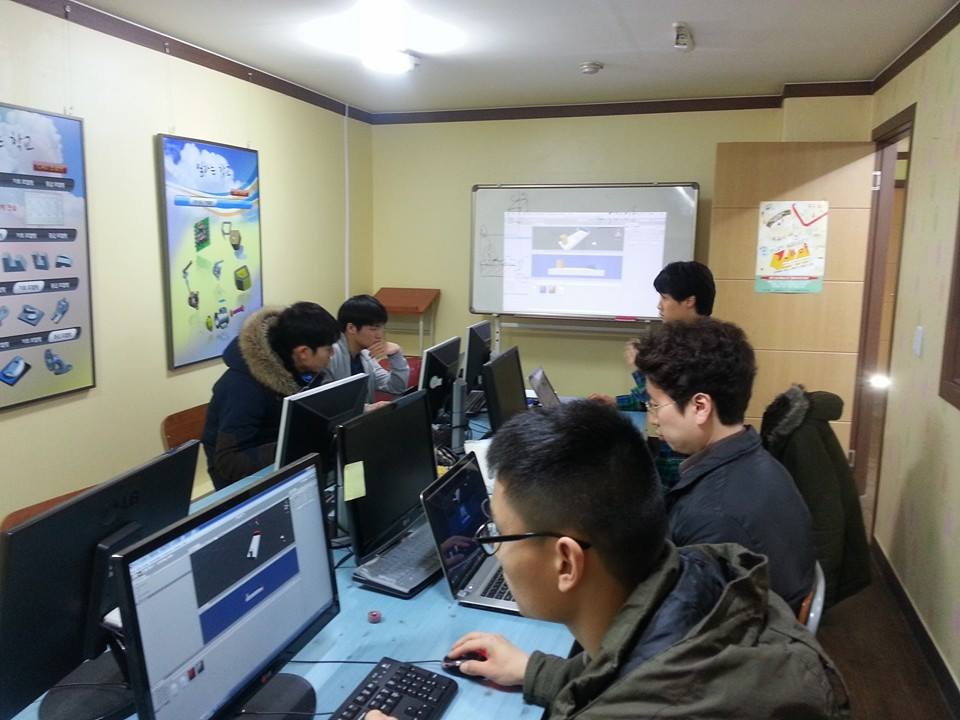
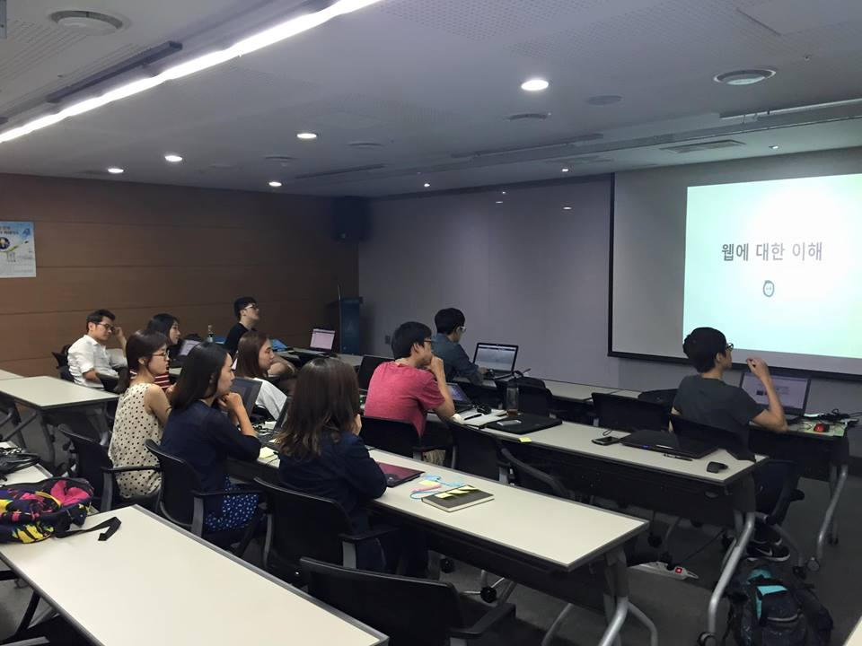

# project 영역 만들기

https://pangol.github.io/page101/ 에서 gallery 영역을 만들어보겠습니다.
image 크기를 조절하는 img-fluid, img-thumbnail을 사용합니다.

## 틀 잡기 - container, row

gallery를 만들 틀을 먼저 잡겠습니다.

```
<div class="gallery container" id="gallery">
  <div class="row">
  </div>
</div>
```

## 영역 나누기

col을 이용해서 영역을 나눕니다. 한 줄에 세 개의 컬럼을 생성합니다.
브라우저 크기가 작을 때는 하나의 이미지가 한 줄을 차지하게 합니다.

```
<div class="gallery container" id="gallery">
  <div class="row">
    <div class="col-md-4 col-sm-12 mb-4">
    </div>
    <div class="col-md-4 col-sm-12 mb-4">
    </div>
    <div class="col-md-4 col-sm-12 mb-4">
    </div>
    <div class="col-md-4 col-sm-12 mb-4">
    </div>
    <div class="col-md-4 col-sm-12 mb-4">
    </div>
    <div class="col-md-4 col-sm-12 mb-4">
    </div>
  </div>
</div>
```

## 이미지 작성하기

img-fluid는 이미지의 크기를 max-width를 100% 설정하며 img-thumbnail은 썸네일처럼 표현해줍니다.

```
<div class="gallery container" id="gallery">
  <div class="row">
    <div class="col-md-4 col-sm-12 mb-4">
      
    </div>
    <div class="col-md-4 col-sm-12 mb-4">
      
    </div>
    <div class="col-md-4 col-sm-12 mb-4">
      
    </div>
    <div class="col-md-4 col-sm-12 mb-4">
      
    </div>
    <div class="col-md-4 col-sm-12 mb-4">
      
    </div>
    <div class="col-md-4 col-sm-12 mb-4">
      
    </div>
  </div>
</div>
```

## style.css 작성하기

이미지들의 가로 크기를 일정하게 하기 위해 style.css에 아래 내용을 추가합니다.

```
.gallery img{
  min-width:100%;
  max-height: 263px;
}
```